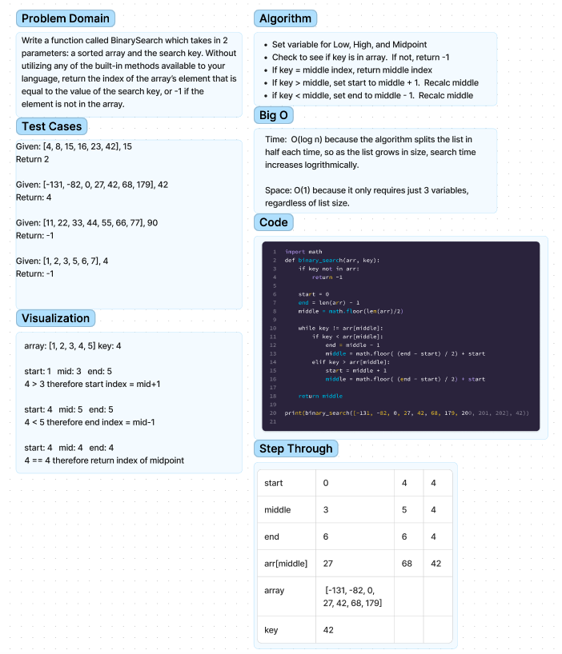

# Class03 - array-binary-search
## Author: Ethan Albers

## Problem Domain
- Write a function called BinarySearch which takes in 2 parameters: a sorted array and the search key. Without utilizing any of the built-in methods available to your language, return the index of the array’s element that is equal to the value of the search key, or -1 if the element is not in the array.

## Whiteboard Process

## Approach & Efficiency

### Algorithm
- Set variable for Low, High, and Midpoint
- Check to see if key is in array.  If not, return -1
- If key = middle index, return middle index
- If key > middle, set start to middle + 1.  Recalc middle
- if key < middle, set end to middle - 1.  Recalc middle

### Big O
- time:  O(N) because the time is directly proportional to the size of the array passed to the function
- space: O(N) because the maximum size of the new array is equal to the old array +1 so the maximum
