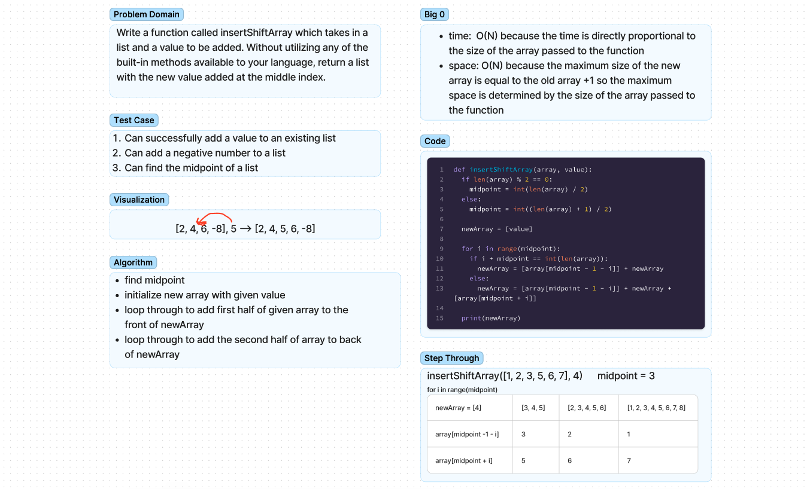

# Class02 - array-insert-shift

- Write a function called insertShiftArray which takes in a list and a value to be added. Without utilizing any of the built-in methods available to your language, return a list with the new value added at the middle index.

## Whiteboard Process

## Approach & Efficiency

- find midpoint
- initialize new array with given value
- loop through to add first half of given array to the front of newArray
- loop through to add the second half of array to back of newArray
### Big O
- time:  O(N) because the time is directly proportional to the size of the array passed to the function
- space: O(N) because the maximum size of the new array is equal to the old array +1 so the maximum space is determined by the size of the array passed to the function

