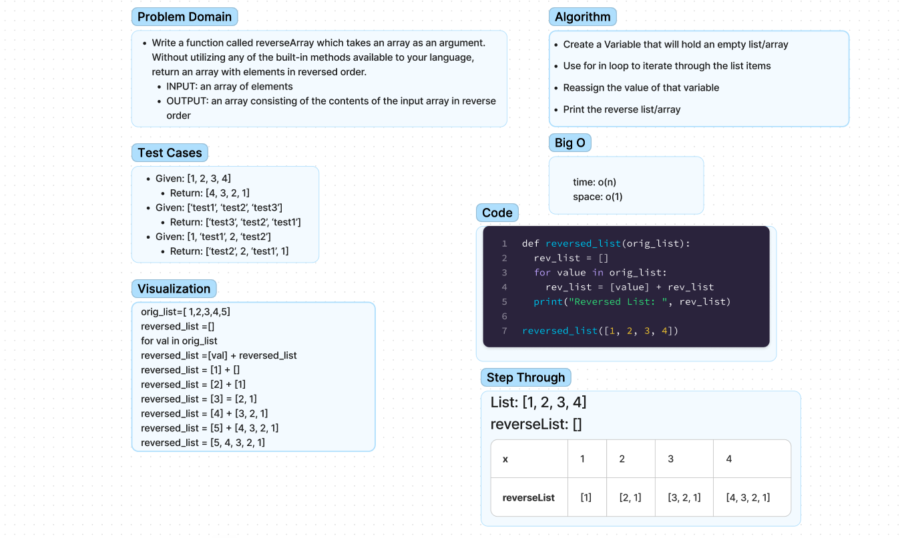

# Class01 - array-reverse

- Write a function called reverseArray which takes an array as an argument. Without utilizing any of the built-in methods available to your language, return an array with elements in reversed order.

## Whiteboard Process

## Approach & Efficiency

- Create a Variable that will hold an empty list/array
- Use for in loop to iterate through the list items
- Reassign the value of that variable
- Print the reverse list/array
### Big O
- time: o(n)
- space: o(1)

## Solution
<!-- Show how to run your code, and examples of it in action -->
