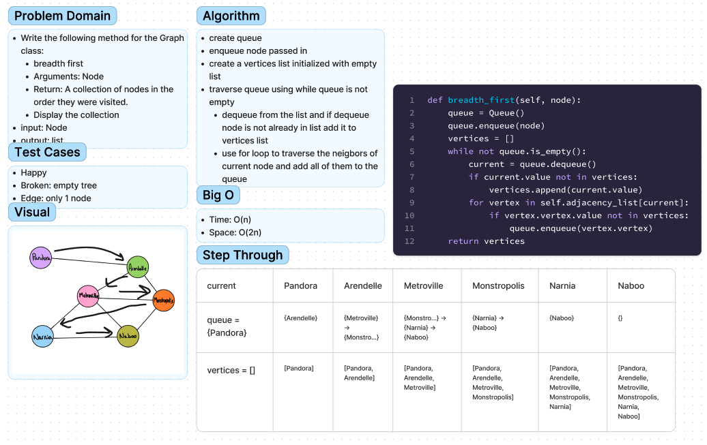

# Challenge36 - Graph Breadth First
## Author: Ethan Albers
## [Github Repo](https://github.com/ekalbers/data-structures-and-algorithms)

### breadth first
- Write the following method for the Graph class:
  - breadth first
  - Arguments: Node
  - Return: A collection of nodes in the order they were visited.
  - Display the collection
- input: Node
- output: list

## Whiteboard Process
### 

## Approach & Efficiency
### breadth first
- create queue
- enqueue node passed in
- create a vertices list initialized with empty list
- traverse queue using while queue is not empty
  - dequeue from the list and if dequeue node is not already in list add it to vertices list
  - use for loop to traverse the neigbors of current node and add all of them to the queue
### big O
  - time: O(N)
  - space: O(N)

## Solution
run tests: 'pytest python/tests/code_challenges/test_graph_breadth_first.py'
