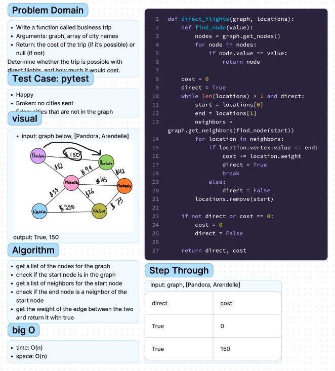

# Chellenge37 - Graph Business Trip
## Author: Ethan Albers
## [Github Repo](https://github.com/ekalbers/data-structures-and-algorithms)
### Write a function called business trip
- Arguments: graph, array of city names
- Return: the cost of the trip (if it’s possible) or null (if not)
- Determine whether the trip is possible with direct flights, and how much it would cost.

## Whiteboard Process
### 

## Approach & Efficiency
- get a list of the nodes for the graph
- check if the start node is in the graph
- get a list of neighbors for the start node
- check if the end node is a neighbor of the start node
- get the weight of the edge between the two and return it with true

### Big O
- time: O(N)
- space: O(N)

## Solution
run tests: `pytest python/tests/code_challenges/test_graph_business_trip.py`
