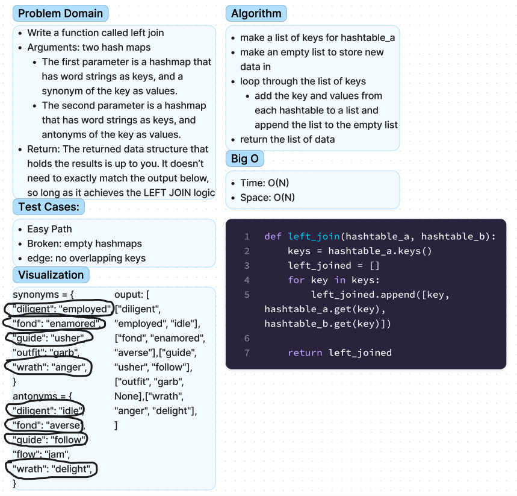

# Chellenge33 - Hashmap Left Join
## [Github Repo](https://github.com/ekalbers/data-structures-and-algorithms)
### Write a function that LEFT JOINs two hashmaps into a single data structure.
- Write a function called left join
- Arguments: two hash maps
- The first parameter is a hashmap that has word strings as keys, and a synonym of the key as values.
- The second parameter is a hashmap that has word strings as keys, and antonyms of the key as values.
- Return: The returned data structure that holds the results is up to you. It doesn’t need to exactly match the output below, so long as it achieves the LEFT JOIN logic

## Whiteboard Process
### 

## Approach & Efficiency
- make a list of keys for hashtable_a
- make an empty list to store new data in
- loop through the list of keys
- add the key and values from each hashtable to a list and append the list to the empty list
- return the list of data

### Big O
- Time: O(N)
- Space: O(N)
## Solution
run tests: 'pytest tests/code_challenges/test_hashtable_left_join.py'
