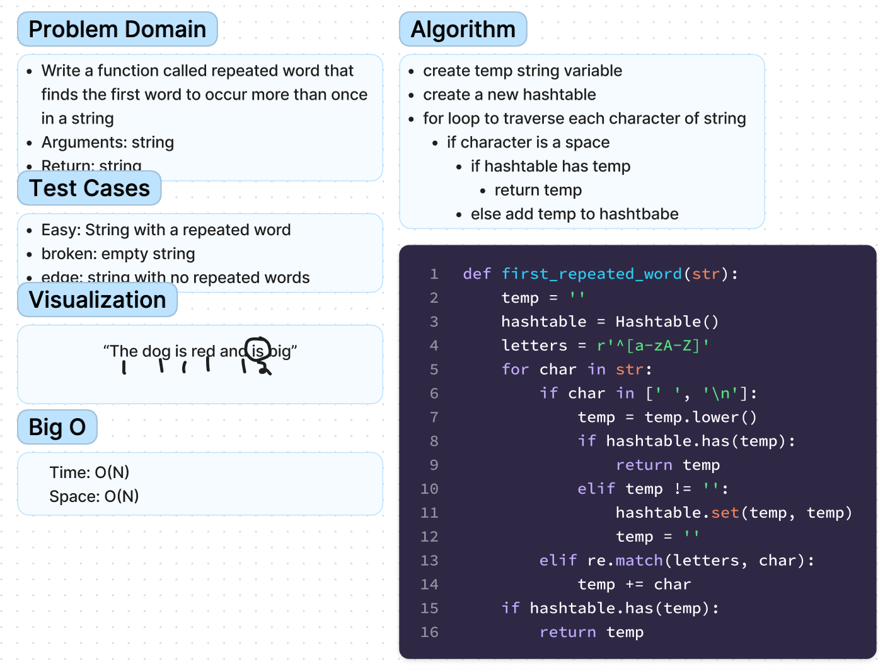

# Chellenge31 - Hashmap Repeated Word
## [Github Repo](https://github.com/ekalbers/data-structures-and-algorithms)
### Find the first repeated word in a book
- Write a function called repeated word that finds the first word to occur more than once in a string
- Arguments: string
- Return: string

## Whiteboard Process
### 

## Approach & Efficiency
- create temp string variable
- create a new hashtable
- for loop to traverse each character of string
- if character is a space
  - if hashtable has temp
    - return temp
  - else add temp to hashtbabe

### Big O
- Time: O(N)
- Space: O(N)
## Solution
run tests: 'pytest tests/code_challenges/test_hashtable_repeated_word.py'
