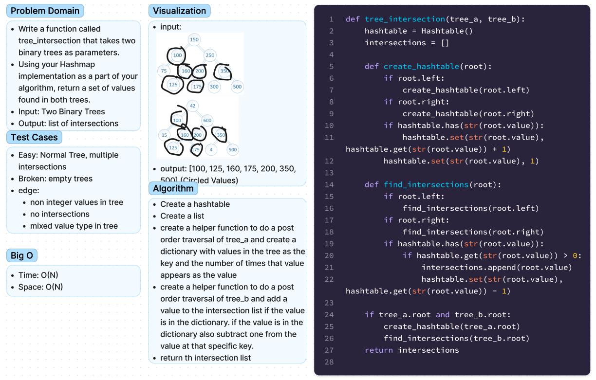

# Chellenge32 - tree intersections
## [Github Repo](https://github.com/ekalbers/data-structures-and-algorithms)
### Find common values in 2 binary trees.
- Write a function called tree_intersection that takes two binary trees as parameters.
- Using your Hashmap implementation as a part of your algorithm, return a set of values found in both trees.
- Input: Two Binary Trees
- Output: list of intersections

## Whiteboard Process
### 

## Approach & Efficiency
- Create a hashtable
- Create a list
- create a helper function to do a post order traversal of tree_a and create a dictionary with values in the tree as the key and the number of times that value appears as the value
- create a helper function to do a post order traversal of tree_b and add a value to the intersection list if the value is in the dictionary. if the value is in the dictionary also subtract one from the value at that specific key.
- return th intersection list

### Big O
- Time: O(N)
- Space: O(N)
## Solution
run tests: 'pytest tests/code_challenges/test_tree_intersections.py'
