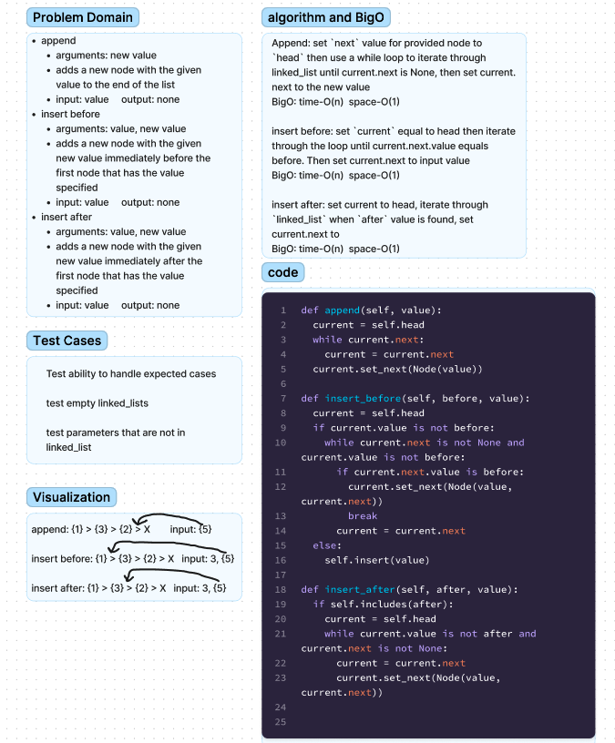

# Chellenge06 - Linked List Insertion
## [Github Repo](https://github.com/ekalbers/data-structures-and-algorithms)
### Write the following Methods for the Linked List Class:
- append
  - arguments: new value
  - adds a new node with the given `value` to the end of the list
- insert before
  - arguments: value, new value
  - adds a new node with the given new value immediately before the first node that has the value specified
- insert after
  - arguments: value, new value
  - adds a new node with the given new value immediately after the first node that has the value specified

## Whiteboard Process
### 

## Approach & Efficiency
### append:
- set `next` value for provided node to `head` then use a while loop to iterate through linked_list until current.next is None, then set current. next to the new value
- bigO
  - time: O(n)
  - space: O(1)
### insert before
- set `current` equal to head then iterate through the loop until current.next.value equals before. Then set current.next to input value
- bigO
  - time: O(n)
  - space: O(1)
### insert after
- set current to head, iterate through `linked_list` when `after` value is found, set current.next to
- bigO
  - time: o(n)
  - space: O(1)

## Solution
run tests: 'pytest'
