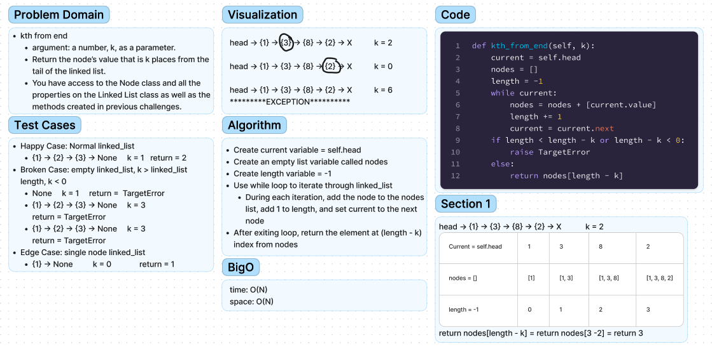

# Chellenge06 - Linked List Insertion
## [Github Repo](https://github.com/ekalbers/data-structures-and-algorithms)
### Write the following Methods for the Linked List Class:
- kth from end
  - argument: a number, k, as a parameter.
  - Return the node’s value that is k places from the tail of the linked list.
  - You have access to the Node class and all the properties on the Linked List class as well as the methods created in previous challenges.

## Whiteboard Process
### 
- I did a recursive implementation that also worked, the original code that is seen on my whiteboard is still in `liinked_list.py` just commented out above the recursive implementation

## Approach & Efficiency
### kth from end
- Create current variable = self.head
- Create an empty list variable called nodes
- Create length variable = -1
- Use while loop to iterate through linked_list
  - During each iteration, add the node to the nodes list, add 1 to length, and set current to the next node
- After exiting loop, return the element at (length - k) index from nodes
### Big O
- time: O(N)
- space: O(N)

## Solution
run tests: 'pytest'
