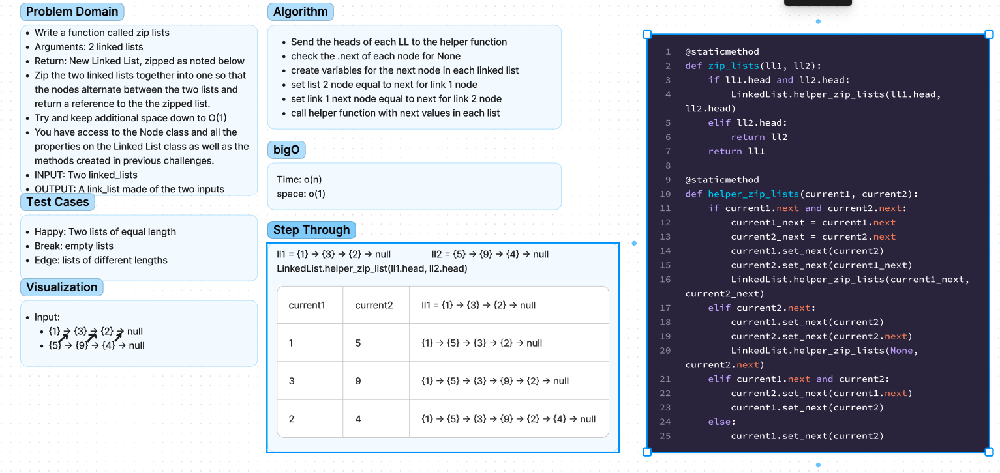

# Chellenge06 - Linked List Insertion
## [Github Repo](https://github.com/ekalbers/data-structures-and-algorithms)
### Write the following Methods for the Linked List Class:
- Write a function called zip lists
- Arguments: 2 linked lists
- Return: New Linked List, zipped as noted below
- Zip the two linked lists together into one so that the nodes alternate between the two lists and return a reference to the the zipped list.
- Try and keep additional space down to O(1)
- You have access to the Node class and all the properties on the Linked List class as well as the methods created in previous challenges.

## Whiteboard Process
### 

## Approach & Efficiency
- Send the heads of each LL to the helper function
- check the .next of each node for None
- create variables for the next node in each linked list
- set list 2 node equal to next for link 1 node
- set link 1 next node equal to next for link 2 node
- call helper function with next values in each list

### Big O
- time: O(N)
- space: O(N)

## Solution
run tests: `pytest`
