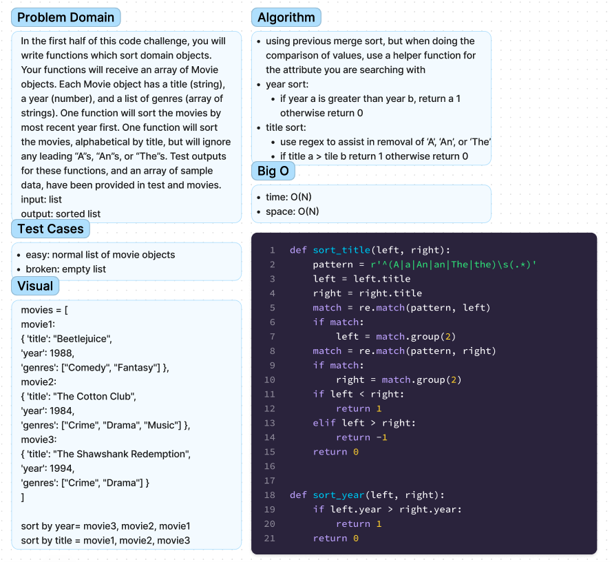

# Chellenge12 - Comparisons
## [Github Repo](https://github.com/ekalbers/data-structures-and-algorithms)
### comparisons
- In the first half of this code challenge, you will write functions which sort domain objects. Your functions will receive an array of Movie objects. Each Movie object has a title (string), a year (number), and a list of genres (array of strings). One function will sort the movies by most recent year first. One function will sort the movies, alphabetical by title, but will ignore any leading “A”s, “An”s, or “The”s. Test outputs for these functions, and an array of sample data, have been provided in test and movies.
- input: list
- output: sorted list

## Whiteboard Process
### 

## Approach & Efficiency
- using previous merge sort, but when doing the comparison of values, use a helper function for the attribute you are searching with
- year sort:
  - if year a is greater than year b, return a 1 otherwise return 0
- title sort:
  - use regex to assist in removal of ‘A’, ‘An’, or ‘The’
  - if title a > tile b return 1 otherwise return 0

### Big O
- time: O(N)
- space: O(N)

## Solution
run tests: 'pytest'
