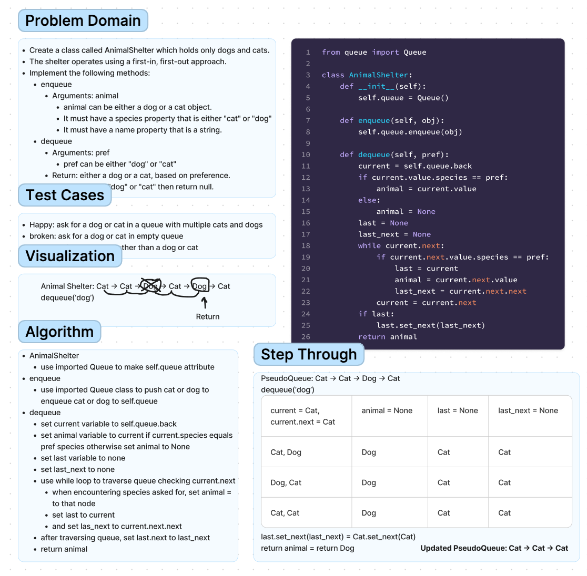

# Chellenge12 - AnimalShelter
## [Github Repo](https://github.com/ekalbers/data-structures-and-algorithms)
### First-in, First out Animal Shelter.
- Create a class called AnimalShelter which holds only dogs and cats.
- The shelter operates using a first-in, first-out approach.
- Implement the following methods:
  - enqueue
    - Arguments: animal
    - animal can be either a dog or a cat object.
    - It must have a species property that is either "cat" or "dog"
    - It must have a name property that is a string.
  - dequeue
    - Arguments: pref
    - pref can be either "dog" or "cat"
    - Return: either a dog or a cat, based on preference.
    - If pref is not "dog" or "cat" then return null.

## Whiteboard Process
### 

## Approach & Efficiency
- AnimalShelter
  - use imported Queue to make self.queue attribute
- enqueue
  - use imported Queue class to push cat or dog to enqueue cat or dog to self.queue
- dequeue
  - set current variable to self.queue.back
  - set animal variable to current if current.species equals pref species otherwise set animal to None
  - set last variable to none
  - set last_next to none
  - use while loop to traverse queue checking current.next
    - when encountering species asked for, set animal = to that node
    - set last to current
    - set las_next to current.next.next
  - after traversing queue, set last.next to last_next
  - return animal

### Big O
- enqueue
  - time: O(1)
  - space: O(1)
- dequeue
  - time: O(N)
  - space: O(1)

## Solution
run tests: 'pytest'
