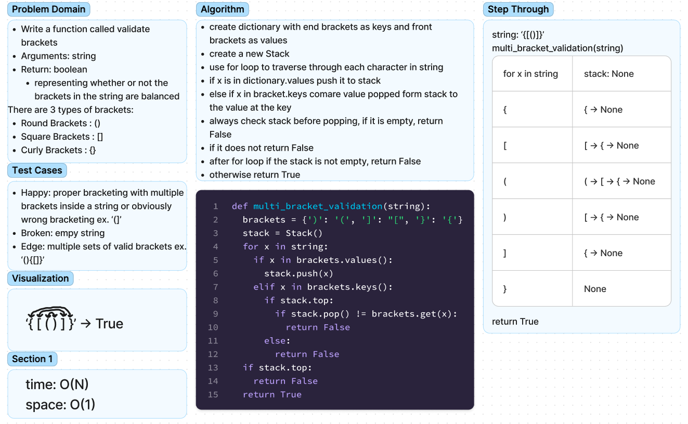

# Chellenge13 - brackets
## [Github Repo](https://github.com/ekalbers/data-structures-and-algorithms)
### Multi-bracket Validation
- Write a function called validate brackets
  - Arguments: string
  - Return: boolean
    - representing whether or not the brackets in the string are balanced
- There are 3 types of brackets:
  - Round Brackets : ()
  - Square Brackets : []
  - Curly Brackets : {}

## Whiteboard Process
### 

## Approach & Efficiency
- AnimalShelter
  - use imported Queue to make self.queue attribute
- enqueue
  - use imported Queue class to push cat or dog to enqueue cat or dog to self.queue
- dequeue
  - set current variable to self.queue.back
  - set animal variable to current if current.species equals pref species otherwise set animal to None
  - set last variable to none
  - set last_next to none
  - use while loop to traverse queue checking current.next
    - when encountering species asked for, set animal = to that node
    - set last to current
    - set las_next to current.next.next
  - after traversing queue, set last.next to last_next
  - return animal

### Big O
- enqueue
  - time: O(1)
  - space: O(1)
- dequeue
  - time: O(N)
  - space: O(1)

## Solution
run tests: 'pytest'
