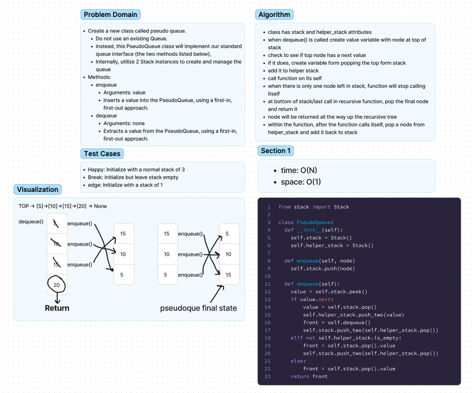

# Chellenge11 - PseudoQue
## [Github Repo](https://github.com/ekalbers/data-structures-and-algorithms)
### Write the following Methods for the Linked List Class:
- Create a new class called pseudo queue.
  - Do not use an existing Queue.
  - Instead, this PseudoQueue class will implement our standard queue interface (the two methods listed below),
  - Internally, utilize 2 Stack instances to create and manage the queue
- Methods:
  - enqueue
    - Arguments: value
    - Inserts a value into the PseudoQueue, using a first-in, first-out approach.
  - dequeue
    - Arguments: none
    - Extracts a value from the PseudoQueue, using a first-in, first-out approach.

## Whiteboard Process
### 

## Approach & Efficiency
- class has stack and helper_stack attributes
- when dequeue() is called create value variable with node at top of stack
- check to see if top node has a next value
- if it does, create variable form popping the top form stack
- add it to helper stack
- call function on its self
- when there is only one node left in stack, function will stop calling itself
- at bottom of stack/last call in recursive function, pop the final node and return it
- node will be returned all the way up the recursive tree
- within the function, after the function calls itself, pop a node from helper_stack and add it back to stack

### Big O
- time: O(N)
- space: O(1)

## Solution
run tests: 'pytest'
