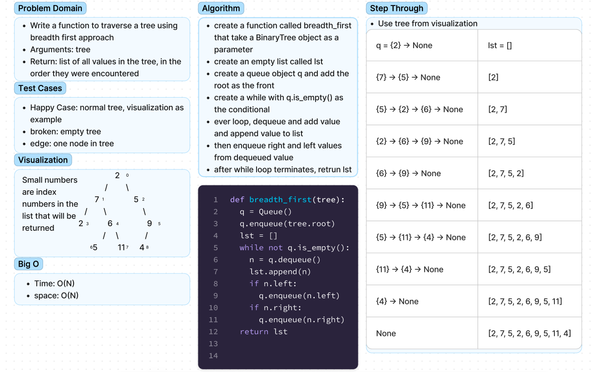

# Challenge17
## [Github Repo](https://github.com/ekalbers/data-structures-and-algorithms)

### breadth first
- Write a function to traverse a tree using breadth first approach
- Arguments: tree
- Return: list of all values in the tree, in the order they were encountered

## Whiteboard Process
### 

## Approach & Efficiency
### breadth first
  - create a function called breadth_first that take a BinaryTree object as a parameter
  - create an empty list called lst
  - create a queue object q and add the root as the front
  - create a while with q.is_empty() as the conditional
  - ever loop, dequeue and add value and append value to list
  - then enqueue right and left values from dequeued value
  - after while loop terminates, return lst
### big O
  - time: O(N)
  - space: O(N)

## Solution
run tests: 'pytest'
