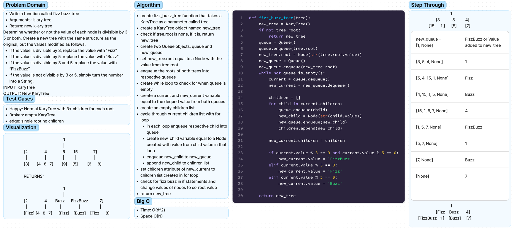

# Chellenge18 - FizzBuzz
## [Github Repo](https://github.com/ekalbers/data-structures-and-algorithms)

### fizz buzz
- Write a function called fizz buzz tree
- Arguments: k-ary tree
- Return: new k-ary tree
- Determine whether or not the value of each node is divisible by 3, 5 or both. Create a new tree with the same structure as the original, but the values modified as follows:
  - If the value is divisible by 3, replace the value with “Fizz”
  - If the value is divisible by 5, replace the value with “Buzz”
  - If the value is divisible by 3 and 5, replace the value with “FizzBuzz”
  - If the value is not divisible by 3 or 5, simply turn the number into a String.
- INPUT: KaryTree
- OUTPUT: New KaryTree

## Whiteboard Process
### 

## Approach & Efficiency
### fizz buzz
- create fizz_buzz_tree function that takes a KaryTree as a parameter called tree
- create a KaryTree object named new_tree
- check if tree.root is none, if it is, return new_tree
- create two Queue objects, queue and new_queue
- set new_tree.root equal to a Node with the value from tree.root
- enqueue the roots of both trees into respective queues
- create while loop to check for when queue is empty
- create a current and new_current variable equal to the dequed value from both queues
- create an empty children list
- cycle through current.children list with for loop
- in each loop enqueue respective child into queue
- create new_child variable equal to a Node created with value from child value in that loop
- enqueue new_child to new_queue
- append new_child to children list
- set children attribute of new_current to children list created in for loop
- check for fizz buzz in if statements and change values of nodes to correct value
- return new_tree
### big O
- Time: O(d^2)
- Space:O(N)

## Solution
run tests: 'pytest'
