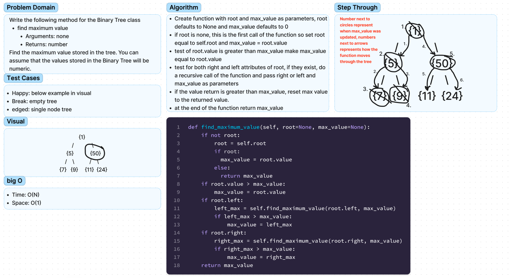

# Chellenge15 - trees
## [Github Repo](https://github.com/ekalbers/data-structures-and-algorithms)

### max
- Write the following method for the Binary Tree class
  - find maximum value
  - Arguments: none
  - Returns: number
- Find the maximum value stored in the tree. You can assume that the values stored in the Binary Tree will be numeric.

## Whiteboard Process
### 

## Approach & Efficiency
### max
  - Create function with root and max_value as parameters, root defaults to None and max_value defaults to 0
  - if root is none, this is the first call of the function so set root equal to self.root and max_value = root.value
  - test of root.value is greater than max_value make max_value equal to root.value
  - test for both right and left attributes of root, if they exist, do a recursive call of the function and pass right or left and max_value as parameters
  - if the value return is greater than max_value, reset max value to the returned value.
  - at the end of the function return max_value
### big O
  - time: O(N)
  - space: O(1)

## Solution
run tests: 'pytest'
